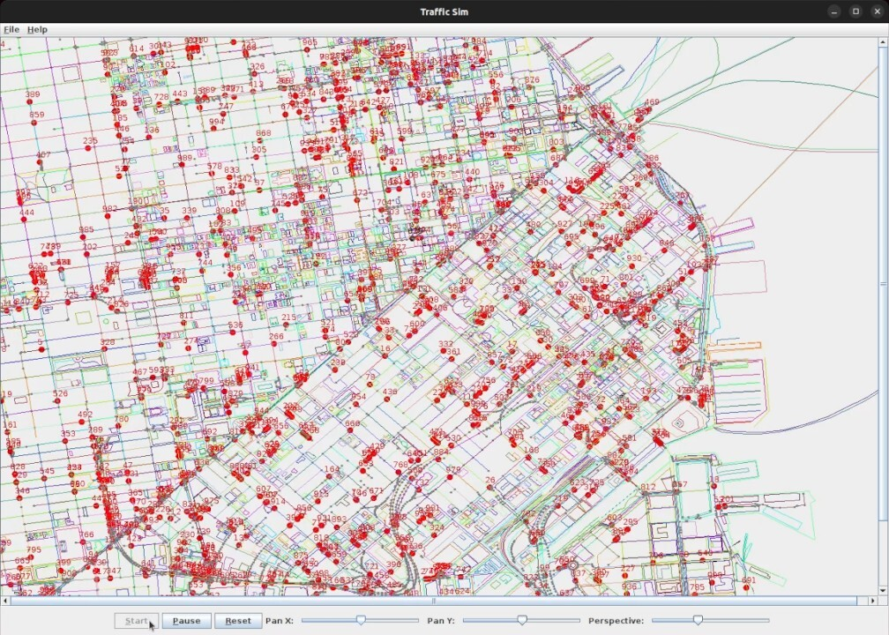

*An old, previously unreleased Java + Swing project circa Summer '13. Now on GitHub! Unfinished, but demoable.*

# TrafficSim

What if cars had wireless sensors communicating their movements to city-wide traffic networks? Or every intersection had cameras able to count the incoming waves?

This simulation demos a traffic grid system where lights can switch intelligently to minimise disruptions.

Its current form is simple: it assumes cars drive shortest path routes to their destination, and it calculates simulation data while rendering in real time. It loads OpenStreetMap data to construct a network of roads, and randomly spawns a wave of cars driving unique routes. Some simplifications regarding traffic laws are made, too.

Future work could be to:
- Fully decouple simulation from rendering
- Implement some sort of monitoring with feedback metrics
- Allow customisation for traffic in-/out-flows (i.e. vehicle sources/sinks)
- Add traffic controllers (lights) with improved performance
- Improve reality of simulation (traffic laws, physics)
- Fix outstanding issues and add some tests



## Build

Install [bazelisk](https://github.com/bazelbuild/bazelisk)

```bash
# For example, if you have node setup already
npm i -g @bazel/bazelisk
```

Then

```bash
# "//..." means build all
bazel build //...
```

## Run

Run the main TrafficSim program with:

```bash
./bazel-bin/src/main/java/trafficsim/TrafficSim
```

## Development

### Bazel

Miscellaneous bazel commands

```bash
bazel build //...
bazel test //...
bazel run //:buildifier # Lint/fix bazel files
bazel clean  # Use sparingly
```

To regenerate `BUILD.bazel` files using [gazelle](https://github.com/bazelbuild/bazel-gazelle):

```bash
bazel run //:gazelle
```

To regenerate build files, build and then run in one command:

```bash
./build-run.sh
```

### Basing build on new image

To set a new open container image in [MODULE.bazel](MODULE.bazel), replace `image` and `digest` in `oci.pull(...)`.

You can get the list of supported images from: https://github.com/GoogleContainerTools/distroless

Then use cosign to checksum the image before building with it:

```bash
go install github.com/sigstore/cosign/v2/cmd/cosign@latest
cosign verify gcr.io/distroless/java11-debian11 --certificate-oidc-issuer https://accounts.google.com  --certificate-identity keyless@distroless.iam.gserviceaccount.com
```

ref: https://docs.sigstore.dev/system_config/installation/

## Credits

Pathfinding uses code from the [AI for Games library](src/main/java/pathfinder).
